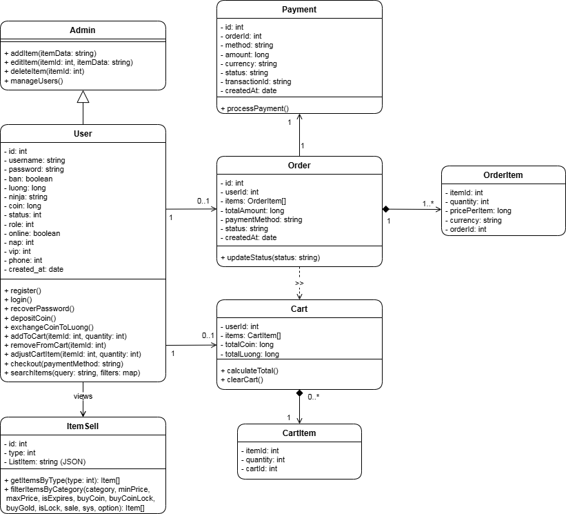
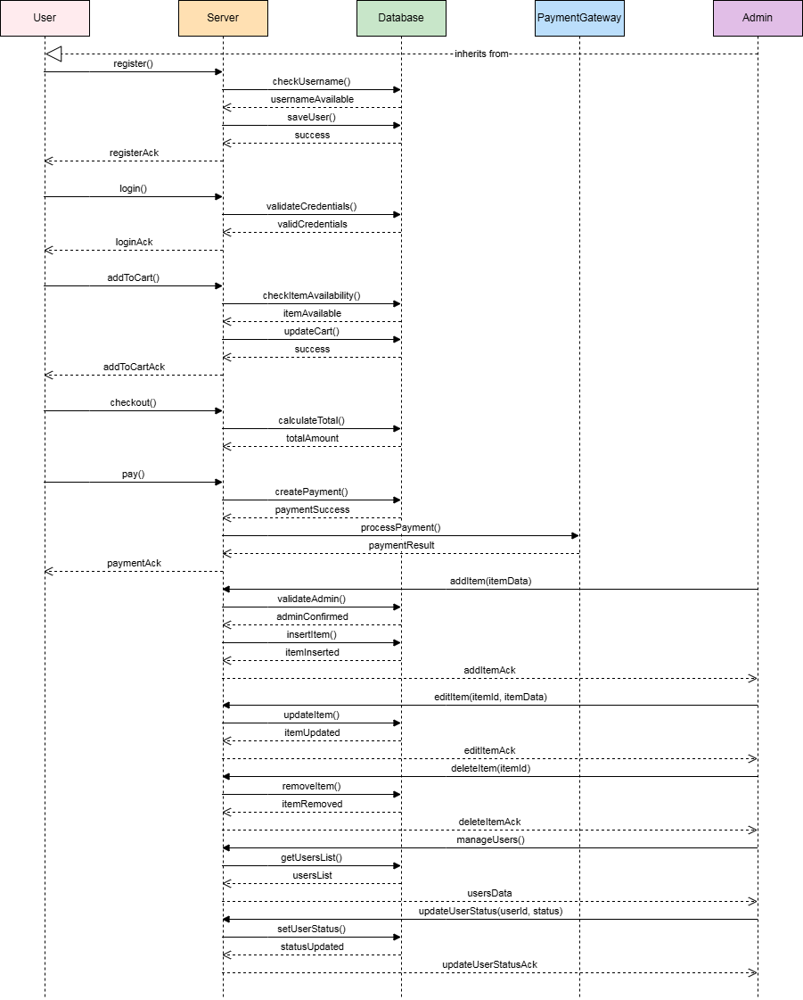

# 🛒 Tạp hóa NSO - Website Bán Hàng (PHP Laravel & MySQL) 🛍️

[](https://opensource.org/licenses/MIT)
[](https://php.net)
[](https://laravel.com)</br>
Một ứng dụng web mô phỏng cửa hàng tạp hóa trực tuyến ("Tạp hóa NSO"), cho phép khách hàng duyệt sản phẩm, quản lý giỏ hàng và đặt hàng. Hệ thống được xây dựng bằng **PHP** với **Laravel Framework** và **MySQL**.

## Mục lục

* [Tính năng](#tính-năng)
* [Công nghệ sử dụng](#công-nghệ-sử-dụng)
* [Yêu cầu hệ thống](#yêu-cầu-hệ-thống)
* [Cài đặt](#cài-đặt)
* [Cấu hình](#cấu-hình)
* [Khởi chạy ứng dụng](#khởi-chạy-ứng-dụng)
* [Cơ sở dữ liệu](#cơ-sở-dữ-liệu)
* [Sơ đồ hệ thống](#sơ-đồ-hệ-thống)
* [Đóng góp](#đóng-góp)
* [Giấy phép](#giấy-phép)
* [Hình ảnh Demo (Tùy chọn)](#hình-ảnh-demo-tùy-chọn)

## ✨ Tính năng

Ứng dụng cung cấp các chức năng thiết yếu cho một trang web bán hàng:

* **Duyệt sản phẩm:** Xem danh sách sản phẩm theo danh mục, xem chi tiết sản phẩm.
* **Tìm kiếm:** Tìm kiếm sản phẩm nhanh chóng.
* **Quản lý Giỏ hàng:** Thêm sản phẩm vào giỏ, cập nhật số lượng, xóa sản phẩm khỏi giỏ.
* **Quy trình Đặt hàng (Checkout):** Nhập thông tin giao hàng, xem lại đơn hàng và đặt hàng (mô phỏng thanh toán).
* **Xác thực Người dùng:** Đăng ký tài khoản mới, Đăng nhập, Đăng xuất.

**Chức năng dành cho Quản trị viên (Admin):**

* **CRUD Sản phẩm:** Quản lý thông tin sản phẩm (thêm, sửa, xóa, cập nhật hình ảnh, giá cả,...).
* **CRUD Danh mục:** Quản lý các danh mục sản phẩm.
* **Quản lý Đơn hàng:** Xem danh sách đơn hàng, cập nhật trạng thái đơn hàng.
* **Quản lý Người dùng:** Xem danh sách người dùng đăng ký.
* _(Các chức năng quản trị khác...)_

## 🚀 Công nghệ sử dụng

Dự án được xây dựng trên nền tảng các công nghệ hiện đại và phổ biến:

| Hạng mục         | Công nghệ / Ngôn ngữ                                                                |
| :--------------- | :---------------------------------------------------------------------------------- |
| **Backend** | PHP 8.x, Laravel Framework 10.x+                                                    |
| **Frontend** | Blade Templates, HTML5, CSS3, JavaScript (ES6+)                                     |
|                  | _(Tùy chọn)_ Bootstrap 5 / Tailwind CSS, Vue.js / React                            |
| **Cơ sở dữ liệu** | MySQL 5.7+ / MariaDB 10.3+                                                          |
| **Web Server** | Nginx / Apache (Production), PHP Development Server (Development)                 |
| **Quản lý gói** | Composer (PHP), NPM / Yarn (JavaScript)                                             |
| **Công cụ khác** | Git, Shell Script, YAML (Config), JSON (API/Data), Makefile (Tùy chọn - Build tasks) |

## 📋 Yêu cầu hệ thống

Đảm bảo môi trường phát triển của bạn đáp ứng các yêu cầu sau:

* **PHP:** Phiên bản `>= 8.0` (Kiểm tra phiên bản Laravel cụ thể bạn đang dùng để biết yêu cầu chính xác).
* **Composer:** Phiên bản mới nhất ([https://getcomposer.org/](https://getcomposer.org/)).
* **Node.js & NPM:** Node.js LTS và NPM đi kèm ([https://nodejs.org/](https://nodejs.org/)).
* **Cơ sở dữ liệu:** MySQL Server (>= 5.7) hoặc MariaDB Server (>= 10.3).
* **Web Server:** Apache hoặc Nginx (khuyến nghị cho production).
* **Git:** Cần thiết để clone và quản lý phiên bản ([https://git-scm.com/](https://git-scm.com/)).

## ⚙️ Cài đặt

Thực hiện các bước sau để cài đặt dự án trên máy cục bộ:

1.  **Clone Repository:**
    Mở terminal và chạy lệnh:
    ```bash
    git clone [https://github.com/anhphap0201/Tap_Hoa_NSO.git](https://github.com/anhphap0201/Tap_Hoa_NSO.git) Tap_Hoa_NSO
    cd Tap_Hoa_NSO
    ```

2.  **Cài đặt Dependencies PHP:**
    ```bash
    composer install --no-dev --optimize-autoloader
    # Dùng --no-dev cho production, bỏ đi nếu là môi trường dev
    ```

3.  **Cài đặt Dependencies Node.js:**
    ```bash
    npm install
    ```

4.  **Biên dịch Frontend Assets:**
    * Cho môi trường development (có hot-reload):
        ```bash
        npm run dev
        ```
    * Cho môi trường production (tối ưu hóa):
        ```bash
        npm run build
        ```

5.  **Tạo file môi trường:**
    Sao chép tệp cấu hình mẫu:
    ```bash
    cp .env.example .env
    ```
    *Lưu ý:* File `.env` chứa các thông tin nhạy cảm, **không bao giờ** commit file này lên Git repository công khai.

6.  **Sinh Khóa Ứng Dụng (Generate App Key):**
    Khóa này dùng để mã hóa session và các dữ liệu nhạy cảm khác.
    ```bash
    php artisan key:generate
    ```

## 🔧 Cấu hình

1.  **Mở tệp `.env`** bằng trình soạn thảo văn bản.
2.  **Cấu hình Kết nối Cơ sở dữ liệu:**
    **Quan trọng:** Dự án này sử dụng **hai kết nối cơ sở dữ liệu riêng biệt**. Cập nhật thông tin cho cả hai kết nối:

    * **Kết nối Chính (Dữ liệu ứng dụng):** Sản phẩm, đơn hàng, danh mục,...
        ```dotenv
        DB_CONNECTION=mysql
        DB_HOST=127.0.0.1      # Hoặc IP/hostname của DB server
        DB_PORT=3306          # Port của DB server
        DB_DATABASE=nso_data  # Tên database chứa dữ liệu chính
        DB_USERNAME=root      # Username kết nối DB
        DB_PASSWORD=          # Password kết nối DB (để trống nếu không có)
        ```
    * **Kết nối Tài khoản (Quản lý người dùng):** Thông tin tài khoản, xác thực,...
        ```dotenv
        DB_ACCOUNT_CONNECTION=mysql # Thường giữ nguyên là mysql
        DB_ACCOUNT_HOST=127.0.0.1      # Thường giống DB_HOST
        DB_ACCOUNT_PORT=3306          # Thường giống DB_PORT
        DB_ACCOUNT_DATABASE=nso_acc   # Tên database chứa dữ liệu tài khoản
        DB_ACCOUNT_USERNAME=root      # Thường giống DB_USERNAME
        DB_ACCOUNT_PASSWORD=          # Thường giống DB_PASSWORD
        ```
    *Đảm bảo bạn đã tạo cả hai database (`nso_data` và `nso_acc`) trên MySQL server.*

3.  **Cấu hình URL ứng dụng:**
    ```dotenv
    APP_URL=http://localhost:8000 # Hoặc URL bạn dùng để truy cập ứng dụng
    ```
4.  **(Tùy chọn)** Cấu hình các dịch vụ khác như Mail, Cache, Queue... trong file `.env` nếu cần.

## ▶️ Khởi chạy ứng dụng

1.  **Thiết lập Cơ sở dữ liệu:**
    * **Cách 1 (Ưu tiên nếu có Migrations):** Chạy Laravel Migrations. Lệnh này thường sẽ tạo bảng cho kết nối database mặc định (`DB_CONNECTION`). Kiểm tra xem migrations có được thiết lập để chạy trên cả hai kết nối hay không, hoặc bạn cần chỉ định kết nối khi chạy migrate.
        ```bash
        php artisan migrate
        # Hoặc chỉ định kết nối nếu cần:
        # php artisan migrate --database=mysql  # Cho kết nối chính
        # php artisan migrate --database=account # Cho kết nối tài khoản (tên kết nối 'account' cần được định nghĩa trong config/database.php)
        ```
        *(Tùy chọn)* Chạy Seeder để thêm dữ liệu mẫu (nếu có):
        ```bash
        php artisan db:seed # Có thể cần chỉ định database hoặc Seeder cụ thể
        ```
    * **Cách 2 (Nếu dùng file .sql):** Thực hiện import các file SQL được cung cấp. **Đảm bảo bạn đã tạo 2 database `nso_data` và `nso_acc` trước.**
        1.  Import file `nso_data.sql` (thường nằm trong thư mục `database/`) vào database `nso_data`.
        2.  Import file `nso_acc.sql` (thường nằm trong thư mục `database/`) vào database `nso_acc`.
        Bạn có thể dùng công cụ như phpMyAdmin, HeidiSQL, MySQL Workbench hoặc command line:
        ```bash
        # Ví dụ dùng command line:
        mysql -u [username] -p nso_data < path/to/nso_data.sql
        mysql -u [username] -p nso_acc < path/to/nso_acc.sql
        ```

2.  **Khởi động Development Server:**
    ```bash
    php artisan serve
    ```

3.  **Truy cập ứng dụng:**
    Mở trình duyệt web và truy cập vào địa chỉ được cung cấp (thường là `http://127.0.0.1:8000` hoặc `http://localhost:8000`).

**Lưu ý:** Đối với môi trường production, bạn cần cấu hình web server (Nginx/Apache) để trỏ vào thư mục `public` của dự án và đảm bảo các biến môi trường được thiết lập chính xác. Tham khảo tài liệu chính thức của Laravel về triển khai: [https://laravel.com/docs/deployment](https://laravel.com/docs/deployment)

## 🗃️ Cơ sở dữ liệu

Dự án sử dụng **MySQL/MariaDB** với **hai cơ sở dữ liệu riêng biệt**:

1.  `nso_data`: Chứa dữ liệu chính của ứng dụng (sản phẩm, danh mục, đơn hàng,...).
2.  `nso_acc`: Chứa dữ liệu liên quan đến tài khoản người dùng và xác thực.

**Cách thiết lập:** Vui lòng xem lại bước 1 trong phần [Khởi chạy ứng dụng](#khởi-chạy-ứng-dụng) để biết chi tiết về việc sử dụng Migrations hoặc import file `.sql`.

## 📊 Sơ đồ hệ thống

Các sơ đồ giúp hình dung cấu trúc và luồng hoạt động của hệ thống.

### Sơ đồ lớp (Class Diagram)

Mô tả cấu trúc các lớp, thuộc tính, phương thức và mối quan hệ giữa chúng trong dự án Tạp hóa NSO.



### Sơ đồ tuần tự (Sequence Diagram)

Mô tả tương tác giữa các đối tượng theo trình tự thời gian cho một chức năng cụ thể (ví dụ: quy trình thêm vào giỏ hàng, đặt hàng).



_(Đảm bảo rằng đường dẫn đến các file ảnh là chính xác)_

## 🤝 Đóng góp

Chúng tôi luôn chào đón sự đóng góp từ cộng đồng! Nếu bạn muốn đóng góp, vui lòng làm theo các bước sau:

1.  **Fork** repository này về tài khoản GitHub của bạn.
2.  **Clone** repository đã fork về máy của bạn.
3.  Tạo một **nhánh mới** cho tính năng hoặc bản sửa lỗi của bạn:
    ```bash
    git checkout -b feature/ten-tinh-nang-moi # Hoặc fix/mo-ta-loi
    ```
4.  Thực hiện các thay đổi và **commit** chúng với message rõ ràng:
    ```bash
    git add .
    git commit -m "feat: Thêm chức năng X" # Hoặc "fix: Sửa lỗi Y"
    # Tham khảo Conventional Commits: [https://www.conventionalcommits.org/](https://www.conventionalcommits.org/)
    ```
5.  **Push** nhánh của bạn lên repository đã fork trên GitHub:
    ```bash
    git push origin feature/ten-tinh-nang-moi
    ```
6.  Mở một **Pull Request (PR)** từ nhánh của bạn vào nhánh `main` (hoặc `develop`) của repository gốc. Cung cấp mô tả chi tiết về những thay đổi trong PR.

Vui lòng đảm bảo code của bạn tuân thủ coding style của dự án (nếu có quy định).

## 📄 Giấy phép

Dự án này được cấp phép dưới giấy phép MIT. Xem chi tiết tại file [LICENSE](LICENSE).

## 📸 Hình ảnh Demo (Tùy chọn)


---

Chúc bạn cài đặt và trải nghiệm dự án "Tạp hóa NSO" thành công! Nếu gặp khó khăn, hãy tạo [Issue](https://github.com/anhphap0201/Tap_Hoa_NSO/issues).